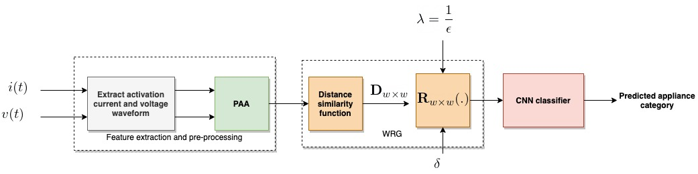

# Improved Appliance Classification in  Non-Intrusive Load Monitoring using  Weighted Recurrence Plots and Convolutional Neural Networks.

This repository is the official implementation of [Improved Appliance Classification in  Non-Intrusive Load Monitoring using  Weighted Recurrence Plots and Convolutional Neural Networks.](). 
The paper present a recurrence graph feature representation that gives a few more values (WRG) instead of the binary output, which improves the robustness of appliance recognition. The WRG representation for activation current and voltage not only enhances appliance classification performance but also guarantees the appliance feature's uniqueness, which is highly desirable for generalization purposes. 

We further, present a novel pre-processing procedure for extracting steady-state cycle activation current from current and voltage measurements. The pre-processing method ensures that the selected activation current is not a transient signal.
Experimental evaluation in the three sub-metered datasets shows that the proposed WRG feature representation offers superior performance when compared to the V-I based image feature.

## Requirements

- python
- numpy
- matplotlib
- tqdm
- torch
- sklearn
- seaborn
- soundfile

## Usage

1. Preprocess the data for a specific datasets
2. To replicate experiment results you can run the `run_experiments.py` code in the experiments directory. 
3. The script used to analyse results and produce visualisation presented in this paper can be found in notebook directory
    - ResultsAnalysis notebook provide scripts for results and error analysis.
    - Visualizepaper notebook provide scripts for reproducing most of the figure used in this paper.

## Results

Our model achieves the following performance on the three sub-metered data-set:

| Dataset         | V-I baseline  | WRG |
| ------------------ |---------------- | -------------- |
| COOLL |    98.95        |      99.86      |
| WHITED  |     89.63        |      97.23       |
| PLAID  |     84.75         |      88.53       |

